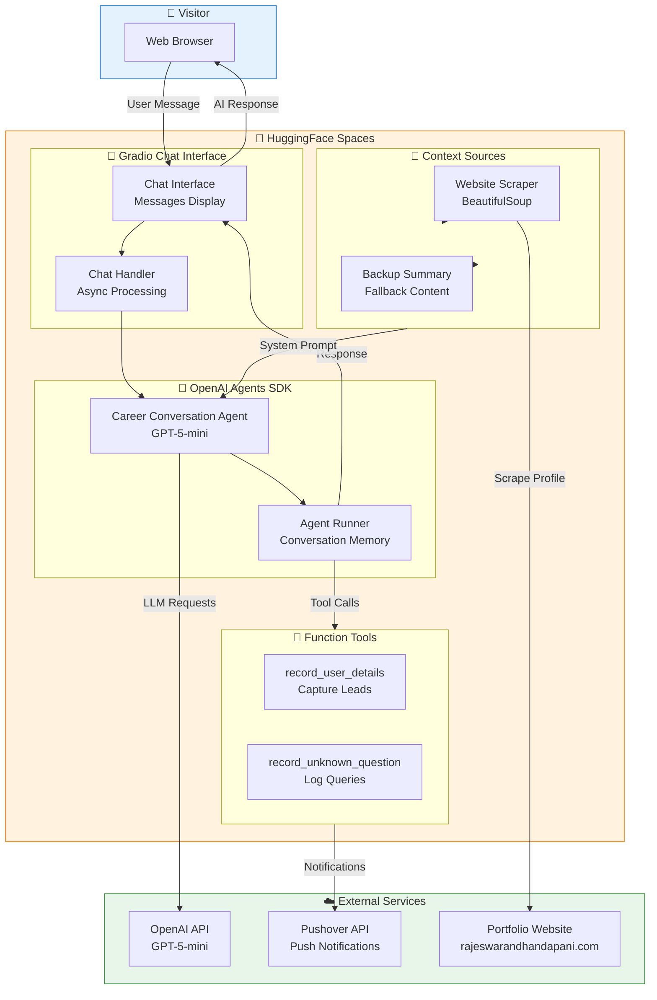

# AI-Powered Career Conversation Agent

**An Intelligent Chatbot for Professional Networking**


## Overview

An intelligent conversational AI agent built with **OpenAI GPT-5-mini** that provides real-time answers about my professional background, skills, and experience. The chatbot extracts information from my LinkedIn profile and portfolio website, features user engagement tracking with push notifications, and includes function calling for recording visitor interactions.

🔗 **[Live Demo on HuggingFace Spaces](https://rajeswarandhandapani-career-conversation-ai-agen-8248a3e.hf.space)**

## Architecture



## Key Features

| Feature | Description |
|---------|-------------|
| **Conversational AI** | Natural language chat powered by OpenAI GPT-5-mini |
| **Live Profile Extraction** | Scrapes portfolio website hourly for up-to-date content |
| **Function Calling** | Custom tools for recording user details and questions |
| **Push Notifications** | Real-time alerts via Pushover API for visitor interactions |
| **Conversation Memory** | Maintains context across messages per IP address |
| **Fallback System** | Backup content if website scraping fails |
| **Hosted on HuggingFace** | Free deployment with Gradio Spaces |

## Tech Stack

- **AI Framework**: OpenAI Agents SDK with GPT-5-mini
- **UI Framework**: Gradio ChatInterface
- **Web Scraping**: BeautifulSoup4
- **Notifications**: Pushover API
- **Hosting**: HuggingFace Spaces
- **Package Manager**: pip + venv
- **Async Runtime**: Python asyncio

## Project Structure

```
career-conversation-AI-agent-chatbot/
├── main.py                    # Entry point
├── chatbot/
│   ├── app.py                 # Main application
│   └── my-profile/
│       └── summary.txt        # Backup profile content
├── requirements.txt           # Python dependencies
└── README.md
```

## How It Works

1. **Profile Extraction**: On startup, scrapes portfolio website for current content
2. **System Prompt**: Builds dynamic prompt with extracted career information
3. **User Message**: Visitor sends a question about career/experience
4. **Agent Processing**: GPT-5-mini processes with career context
5. **Tool Execution**: Optionally records user details or unknown questions
6. **Push Notification**: Sends alert to Pushover for visitor tracking
7. **Response**: Returns professional, first-person career response

## Quick Start

### Prerequisites
- Python 3.11+
- OpenAI API Key
- Pushover Account (optional, for notifications)

### Installation

```bash
# Clone the repository
git clone https://github.com/rajeswarandhandapani/career-conversation-AI-agent-chatbot.git
cd career-conversation-AI-agent-chatbot

# Create and activate virtual environment
python -m venv venv
source venv/bin/activate  # On Windows: venv\Scripts\activate

# Install dependencies
pip install -r requirements.txt

# Configure environment variables
cp .env.example .env
# Edit .env with your API keys:
# OPENAI_API_KEY=your_key
# PUSHOVER_TOKEN=your_token
# PUSHOVER_USER=your_user

# Run locally
python chatbot/app.py
```

### Deploy to HuggingFace Spaces

```bash
# Deploy with Gradio
gradio deploy

# Follow prompts:
# - Name: career_conversation
# - File: chatbot/app.py
# - Hardware: cpu-basic
# - Provide secrets: OPENAI_API_KEY, PUSHOVER_TOKEN, PUSHOVER_USER
```

## Environment Variables

| Variable | Required | Description |
|----------|----------|-------------|
| `OPENAI_API_KEY` | Yes | OpenAI API key for GPT-5-mini |
| `PUSHOVER_TOKEN` | No | Pushover API token for notifications |
| `PUSHOVER_USER` | No | Pushover user key for notifications |

## License

MIT

---

*Created by [Rajeswaran Dhandapani](https://rajeswarandhandapani.com)*