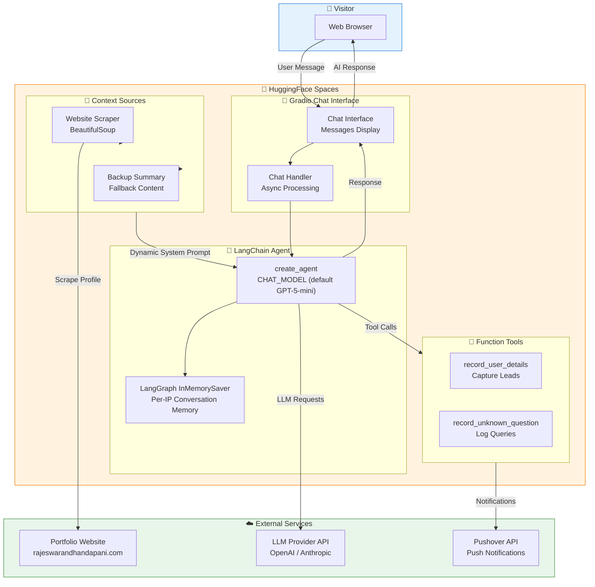

# AI-Powered Career Conversation Agent

**An Intelligent Chatbot for Professional Networking**


## Overview

An intelligent conversational AI agent built with **LangChain 1.x** (`create_agent` on the LangGraph runtime) that provides real-time answers about my professional background, skills, and experience. The underlying LLM is provider-agnostic — it defaults to **OpenAI GPT-5-mini** and can be switched to Anthropic Claude (or any other supported provider) with a single `CHAT_MODEL` environment variable. The chatbot extracts information from my portfolio website, features user engagement tracking with push notifications, and includes tool calling for recording visitor interactions.

🔗 **[Live Demo on HuggingFace Spaces](https://rajeswarandhandapani-career-conversation-ai-agen-8248a3e.hf.space)**

## Architecture


```mermaid
flowchart TB
    subgraph User["👤 Visitor"]
        Browser["Web Browser"]
    end

    subgraph HuggingFace["🤗 HuggingFace Spaces"]
        subgraph GradioApp["🎨 Gradio Chat Interface"]
            ChatUI["Chat Interface<br/>Messages Display"]
            ChatHandler["Chat Handler<br/>Async Processing"]
        end
        
        subgraph Agent["🦜 LangChain Agent"]
            CareerAgent["create_agent<br/>CHAT_MODEL (default GPT-5-mini)"]
            Checkpointer["LangGraph InMemorySaver<br/>Per-IP Conversation Memory"]
        end
        
        subgraph Tools["🔧 Function Tools"]
            RecordUser["record_user_details<br/>Capture Leads"]
            RecordQuestion["record_unknown_question<br/>Log Queries"]
        end
        
        subgraph Context["📄 Context Sources"]
            WebScraper["Website Scraper<br/>BeautifulSoup"]
            BackupFile["Backup Summary<br/>Fallback Content"]
        end
    end

    subgraph External["☁️ External Services"]
        LLM["LLM Provider API<br/>OpenAI / Anthropic"]
        Pushover["Pushover API<br/>Push Notifications"]
        Portfolio["Portfolio Website<br/>rajeswarandhandapani.com"]
    end

    Browser -->|"User Message"| ChatUI
    ChatUI --> ChatHandler
    ChatHandler --> CareerAgent
    CareerAgent --> Checkpointer
    CareerAgent -->|"Tool Calls"| Tools
    Tools -->|"Notifications"| Pushover
    CareerAgent -->|"LLM Requests"| LLM
    WebScraper -->|"Scrape Profile"| Portfolio
    WebScraper --> Context
    BackupFile --> Context
    Context -->|"Dynamic System Prompt"| CareerAgent
    CareerAgent -->|"Response"| ChatUI
    ChatUI -->|"AI Response"| Browser

    style User fill:#e3f2fd,stroke:#1976d2
    style HuggingFace fill:#fff3e0,stroke:#f57c00
    style External fill:#e8f5e9,stroke:#388e3c
```

## Key Features

| Feature | Description |
|---------|-------------|
| **Conversational AI** | Natural language chat powered by LangChain agents (GPT-5-mini by default) |
| **Model Portability** | Switch LLM provider (OpenAI, Anthropic, ...) via the `CHAT_MODEL` env var — no code change |
| **Live Profile Extraction** | Scrapes portfolio website hourly for up-to-date content |
| **Function Calling** | Custom tools for recording user details and questions |
| **Push Notifications** | Real-time alerts via Pushover API for visitor interactions |
| **Conversation Memory** | LangGraph `InMemorySaver` checkpointer keyed by visitor IP (`thread_id`) |
| **Fallback System** | Backup content if website scraping fails |
| **Hosted on HuggingFace** | Free deployment with Gradio Spaces |

## Tech Stack

- **AI Framework**: LangChain 1.x (`create_agent`) + LangGraph checkpointing
- **LLM Providers**: langchain-openai (default: GPT-5-mini), langchain-anthropic (Claude), and langchain-groq (open models on LPU), selected via `CHAT_MODEL`
- **UI Framework**: Gradio 6 ChatInterface
- **Web Scraping**: BeautifulSoup4
- **Notifications**: Pushover API
- **Hosting**: HuggingFace Spaces
- **Package Manager**: pip + venv
- **Async Runtime**: Python asyncio

## Project Structure

```
career-conversation-AI-agent-chatbot/
├── chatbot/
│   ├── app.py                 # Main application
│   ├── README.md              # HuggingFace Spaces config (frontmatter)
│   ├── requirements.txt       # Pinned Python dependencies (canonical)
│   └── my-profile/
│       └── summary.txt        # Backup profile content
├── requirements.txt           # Includes chatbot/requirements.txt
├── .env.example               # Environment variable template
└── README.md
```

## How It Works

1. **Profile Extraction**: On startup, scrapes portfolio website for current content (refreshed hourly)
2. **Dynamic System Prompt**: A LangChain `@dynamic_prompt` middleware rebuilds the prompt per model call with the latest career information
3. **User Message**: Visitor sends a question about career/experience
4. **Agent Processing**: The configured LLM (`CHAT_MODEL`) processes with career context
5. **Tool Execution**: Optionally records user details or unknown questions
6. **Push Notification**: Sends alert to Pushover for visitor tracking
7. **Memory**: Conversation state is checkpointed per visitor IP via LangGraph `InMemorySaver`
8. **Response**: Returns professional, first-person career response

## Quick Start

### Prerequisites
- Python 3.11+
- OpenAI API Key
- Pushover Account (optional, for notifications)

### Installation

```bash
# Clone the repository
git clone https://github.com/rajeswarandhandapani/career-conversation-AI-agent-chatbot.git
cd career-conversation-AI-agent-chatbot

# Create and activate virtual environment
python -m venv venv
source venv/bin/activate  # On Windows: venv\Scripts\activate

# Install dependencies
pip install -r requirements.txt

# Configure environment variables
cp .env.example .env
# Edit .env with your API keys:
# OPENAI_API_KEY=your_key   (or ANTHROPIC_API_KEY when using an Anthropic CHAT_MODEL)
# PUSHOVER_TOKEN=your_token
# PUSHOVER_USER=your_user

# Run locally
python chatbot/app.py
```

### Switching Models

The LLM is set by the `CHAT_MODEL` environment variable as a LangChain `provider:model` string — no code change needed:

```bash
CHAT_MODEL=openai:gpt-5-mini            # default
CHAT_MODEL=anthropic:claude-sonnet-5
CHAT_MODEL=anthropic:claude-haiku-4-5
CHAT_MODEL=groq:openai/gpt-oss-120b     # fast open-model inference, free tier
```

Locally, set it in `.env`; on HuggingFace Spaces, set it as a Space variable. Provide the matching provider API key (`OPENAI_API_KEY`, `ANTHROPIC_API_KEY`, or `GROQ_API_KEY`).

### Deploy to HuggingFace Spaces

```bash
# Deploy with Gradio
gradio deploy

# Follow prompts:
# - Name: career_conversation
# - File: chatbot/app.py
# - Hardware: cpu-basic
# - Provide secrets: OPENAI_API_KEY (and/or ANTHROPIC_API_KEY), PUSHOVER_TOKEN, PUSHOVER_USER
```

## Environment Variables

| Variable | Required | Description |
|----------|----------|-------------|
| `CHAT_MODEL` | No | LangChain `provider:model` string (default: `openai:gpt-5-mini`) |
| `OPENAI_API_KEY` | Yes* | OpenAI API key (*required for the default `CHAT_MODEL`) |
| `ANTHROPIC_API_KEY` | No* | Anthropic API key (*required when `CHAT_MODEL` uses `anthropic:`) |
| `GROQ_API_KEY` | No* | Groq API key (*required when `CHAT_MODEL` uses `groq:`) |
| `PUSHOVER_TOKEN` | No | Pushover API token for notifications |
| `PUSHOVER_USER` | No | Pushover user key for notifications |
| `LANGSMITH_TRACING` | No | Set to `true` to enable LangSmith tracing |
| `LANGSMITH_API_KEY` | No | LangSmith API key (when tracing is enabled) |

## License

MIT

---

*Created by [Rajeswaran Dhandapani](https://rajeswarandhandapani.com)*